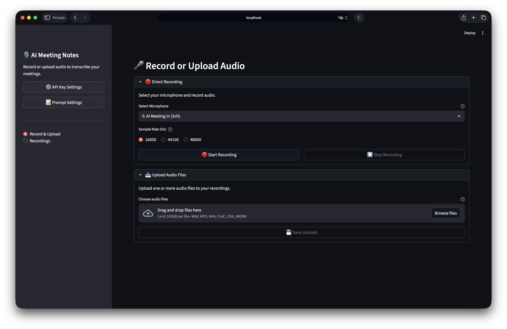

# AI Meeting Notes

A Streamlit-based application for recording, managing, transcribing, and converting meeting audio into structured AI-powered meeting notes using OpenAI's Whisper and GPT-5 APIs.



## Features

- 🎙️ **Audio Recording & Upload**: Record from microphone (multi-channel) or upload audio files (WAV, MP3, M4A, FLAC, OGG, WebM)
- 📝 **AI Transcription**: Multiple OpenAI models (GPT-4o Mini, GPT-4o, Whisper-1) with automatic language detection
- 🤖 **AI Meeting Notes**: Transform transcriptions into structured meeting notes with GPT-5 models
- 📦 **Smart Compression**: Automatic compression for large files (>25MB) or long audio (>20min)
- ⚡ **Long Audio Support**: Automatic chunking and parallel processing for files over 20 minutes
- 🔒 **Secure Storage**: Store any content in your desktop

## Prerequisites

- **Python 3.12+**
- **FFmpeg**: `brew install ffmpeg` (macOS) or `sudo apt-get install ffmpeg` (Ubuntu)
- **OpenAI API Key**: Get from [OpenAI Platform](https://platform.openai.com/api-keys)
- **uv Package Manager**: [Install uv](https://github.com/astral-sh/uv)

## Installation

```bash
# Clone repository
git clone https://github.com/DevSlem/ai-meeting-notes.git
cd ai-meeting-notes

# Install dependencies and start the app
uv run streamlit run main.py
```

The app opens at `http://localhost:8501`.

> [!NOTE]
> Docker is not recommended for this application as it requires direct microphone access which is difficult to configure in containers.

## Quick Start

1. **Setup API Key**: Click ⚙️ API Key Settings → Enter OpenAI API key → Save
2. **Record/Upload**: Navigate to "Record & Upload" tab
3. **Manage**: Go to "Recordings" tab to view all files
4. **Transcribe**: Click 🎙️ button next to any recording
5. **Generate Notes**: Click 📝 button to create AI meeting notes
6. **View Full Page**: Click 📖 View Full Page for distraction-free reading

## Usage

### Recording Audio
1. Select microphone and sample rate (16kHz recommended)
2. Click 🔴 Start Recording → Speak → ⏹️ Stop Recording
3. File saved automatically to `recordings/` directory

> [!NOTE]
> We provide multi-channel recording support. If you want to record both your microphone and system audio (e.g., Zoom calls), use a virtual audio device like [BlackHole (macOS)](https://github.com/ExistentialAudio/BlackHole) or [VB-Audio Virtual Cable (Windows)](https://vb-audio.com/Cable/).

### Transcribing Audio
1. Click 🎙️ button in Recordings tab
2. Select model (GPT-4o Mini recommended for most cases)
3. Configure advanced options if needed:
   - **Compression**: Auto-enabled for large/long files
   - **Chunk Overlap**: 30s default (adjustable 15-120s)
   - **Language**: Auto-detect or specify (en, ko, ja, etc.)
4. Click Start Transcription
5. View results in scrollable text area

### Generating AI Meeting Notes
1. Transcribe audio first (required)
2. Click 📝 button next to the recording
3. Select model:
   - **GPT-5**: Best quality, complex meetings ($1.25/$10 per 1M tokens)
   - **GPT-5 Mini**: Balanced (recommended) ($0.25/$2 per 1M tokens)
   - **GPT-5 Nano**: Fast & affordable ($0.05/$0.40 per 1M tokens)
4. Choose output language (auto-detect recommended)
5. Configure advanced options:
   - **Prompt Template**: Select or create custom prompts
   - **Reasoning Effort**: minimal/low/medium/high
   - **Max Output Tokens**: 1000-8000
6. Review cost estimate
7. Click 📝 Generate Meeting Notes

### Viewing Meeting Notes
- **In Details**: Toggle between 📝 AI Meeting Notes and 📄 Transcription
- **Full Page**: Click 📖 View Full Page for better reading experience
  - Shows metadata (model, generation time, tokens used)
  - Distraction-free markdown rendering
  - 🔄 Regenerate option
  - ← Back to return to recordings

### Managing Custom Prompts
1. Click 📝 Prompt Settings in sidebar
2. **Create New Prompt**:
   - Click ➕ Create New Prompt
   - Enter name (e.g., "technical-meeting")
   - Write prompt content (use `{LANGUAGE_INSTRUCTION}` placeholder)
   - Click 💾 Create Prompt
3. **Edit Prompt**:
   - Select prompt from dropdown
   - Click ✏️ Edit This Prompt
   - Modify content
   - Click 💾 Save Changes
4. **Delete Prompt**:
   - Select prompt (except default)
   - Click 🗑️ Delete This Prompt

### Custom Naming
1. Click ✏️ button next to recording
2. Enter meaningful name (e.g., "Weekly Team Meeting")
3. Original filename preserved, display name stored in `<filename>.json`

## Compression Methods

| Method | Ratio | Speed | Use Case |
|--------|-------|-------|----------|
| **Recommended** | 75-85% | Medium | Meetings with silence removal |
| **Fast (MP3)** | 60-70% | Fast | Quick compression |
| **Balanced (Opus)** | 65-75% | Medium | Efficient for speech |
| **Custom** | Varies | Varies | Specify your own FFmpeg options |

Compression **auto-enabled** when file >25MB or duration >20min.

> [!WARNING]
> The ratio is arbitrary and depends on the audio content.

## API Models & Pricing

### Transcription Models

| Model | Price/hour | Best For |
|-------|------------|----------|
| `gpt-4o-mini-transcribe` | $0.18 | Most meetings (recommended) |
| `gpt-4o-transcribe` | $0.36 | Complex audio, heavy accents |
| `whisper-1` | $0.36 | When timestamps needed |

### AI Meeting Notes Models (GPT-5 Series)

| Model | Price (Input/Output per 1M tokens) | Best For | Speed |
|-------|------------|----------|-------|
| `gpt-5` | $1.25 / $10 | Complex meetings, high quality | Slower |
| `gpt-5-mini` | $0.25 / $2 | Most meetings (recommended) | Balanced |
| `gpt-5-nano` | $0.05 / $0.40 | Simple summaries, quick notes | Fastest |

**Reasoning Effort Levels:**
- **minimal**: Fastest, least reasoning tokens
- **low**: Quick processing (default)
- **medium**: Balanced quality/speed
- **high**: Best quality, more expensive

## File Structure

```
ai-meeting-notes/
├── recordings/
│   ├── recording_20251013_145550.wav      # Audio file
│   ├── recording_20251013_145550.json     # Metadata (name, transcription, meeting notes)
│   └── recording_20251013_145550.txt      # Legacy transcription (migrated to JSON)
├── prompts/
│   └── meeting-notes/
│       ├── default.txt                    # Default prompt template
│       ├── technical-meeting.txt          # Custom prompt example
│       └── standup.txt                    # Custom prompt example
├── .config/
│   └── api_key.txt                        # OpenAI API key (auto-created)
├── src/
│   ├── audio.py                           # Audio recording
│   ├── transcription.py                   # Whisper transcription
│   ├── meeting_notes.py                   # GPT-5 meeting notes generation
│   ├── file_manager.py                    # File & metadata management
│   ├── audio_processor.py                 # Compression & chunking
│   ├── config.py                          # API key management
│   └── streamlit_ui.py                    # UI implementation
└── main.py                                # Application entry point
```

## Metadata Structure

Each audio file has a companion `.json` file storing:
```json
{
  "display_name": "Weekly Team Meeting",
  "transcription": "Meeting transcription text...",
  "transcribed_at": "2025-10-15T14:30:00",
  "meeting_notes": "# Meeting Summary\n...",
  "meeting_notes_model": "gpt-5-mini",
  "meeting_notes_generated_at": "2025-10-15T14:35:00",
  "meeting_notes_usage": {
    "prompt_tokens": 1500,
    "completion_tokens": 800,
    "total_tokens": 2300,
    "reasoning_tokens": 50
  }
}
```

## Troubleshooting

**FFmpeg not found**: Install with `brew install ffmpeg` (macOS) or `sudo apt-get install ffmpeg` (Ubuntu)

**API key issues**: Click ⚙️ API Key Settings and verify your key at [OpenAI Platform](https://platform.openai.com/api-keys)

**Dialog not closing**: Use Close/Done buttons instead of X button

**Long files**: App automatically chunks files >23min with intelligent merging

**Empty meeting notes**: Check transcription exists and try regenerating with different model

**Streamlit media errors in logs**: Harmless internal caching issue, does not affect functionality

## Tips

### General
- Let app auto-decide compression (enabled only when beneficial)
- Rename recordings immediately for easy identification
- Monitor API usage at [OpenAI Usage Dashboard](https://platform.openai.com/usage)

### Transcription
- Use GPT-4o Mini for most meetings
- Specify language code for better accuracy if auto-detect fails
- For long meetings, increase chunk overlap if transcription seems disjointed

### AI Meeting Notes
- **Start with GPT-5 Mini** (best balance of quality/cost)
- Use **GPT-5 Nano** for quick summaries or budget constraints
- Use **GPT-5** only for complex technical meetings
- **Low reasoning effort** is sufficient for most meetings
- Create **custom prompts** for recurring meeting types (standups, sales calls, etc.)
- Use **auto-detect language** unless you need specific output language
- **Full Page View** for comfortable reading and reviewing
- **Regenerate** if first result isn't satisfactory (try different model or reasoning effort)

### Custom Prompts
- Include `{LANGUAGE_INSTRUCTION}` placeholder for language flexibility
- Test prompts with different meeting types before committing
- Name prompts descriptively (e.g., "sales-call", "technical-review")
- Keep default prompt as fallback reference

## Architecture

The application follows a modular architecture:

1. **Frontend (Streamlit)**: Multi-page interface with dialogs
2. **Audio Layer**: Recording and compression
3. **Transcription Layer**: OpenAI Whisper integration
4. **AI Notes Layer**: GPT-5 meeting notes generation
5. **Storage Layer**: Local file system with JSON metadata

---

**Built with Streamlit, OpenAI Whisper API, OpenAI GPT-5 API, and FFmpeg**

**License**: MIT
